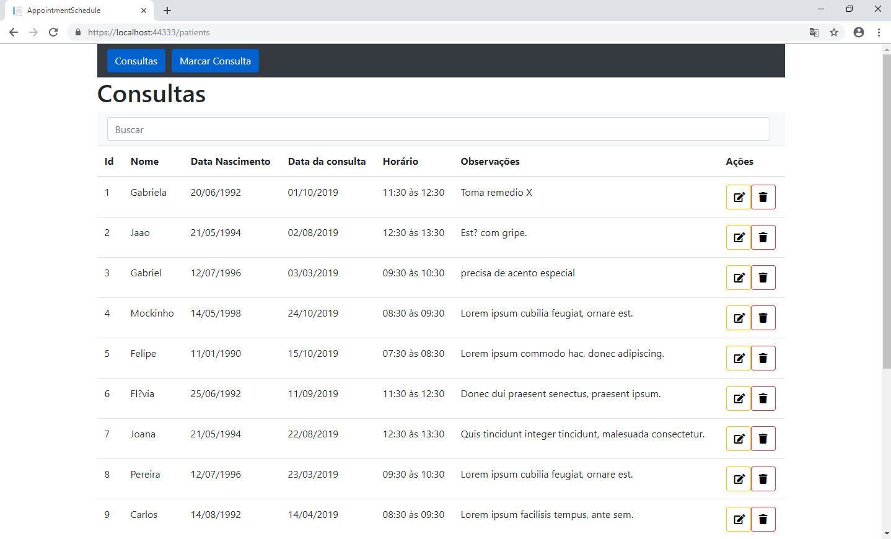
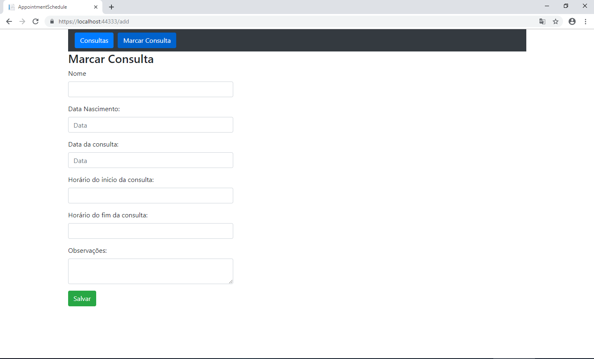
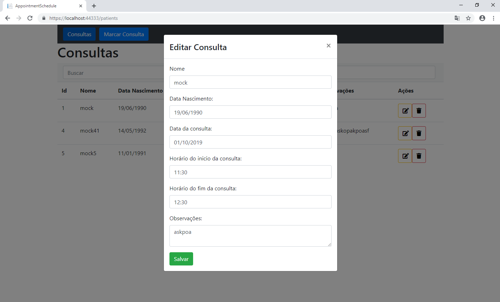

##Projeto feito para vaga de desenvolvedor na ITIX 

##Tecnologias;
	-Dotnet core 2.2 Backend
	-Angular 6 frontEnd
	-Evolve para migrations
	-Nunit para testes de unidade

##Comandos para executar a App
	- 'npm i' dentro do diretório ClientApp para baixar as dependências
	- Criar banco de dados (sugestão = appointment_schedule) e indicar o banco, no appSettings.json, Ex:
		- "MsSqlConnection": {
		   "MsSqlConnectionString": "Server=Maquina\\SQLEXPRESS;Database=appointment_schedule;User Id=user\\joao.carmo;Password=2134;Trusted_Connection=true;"
			},
		- colocar o campo password se tiver senha de usuário windows, no caso eu coloquei uma connectionsString de umas instância do SQL SERVER EXPRESS, essa é a forma de autênticação no banco.
	- Após criar e colocar o nome do banco dentro da app é só executar, será feito o migrate com as tabelas e alguns mocks para teste.
	-Qualquer dúvida só entrar em contato
		- rafael.contatotrab@gmail.com
		- cel:988830467 wpp, 981027002
		
## algumas imagens da App
	Tela Inicial
	
	
	 
	Cadastro
	
	
	 
	Alteração
	